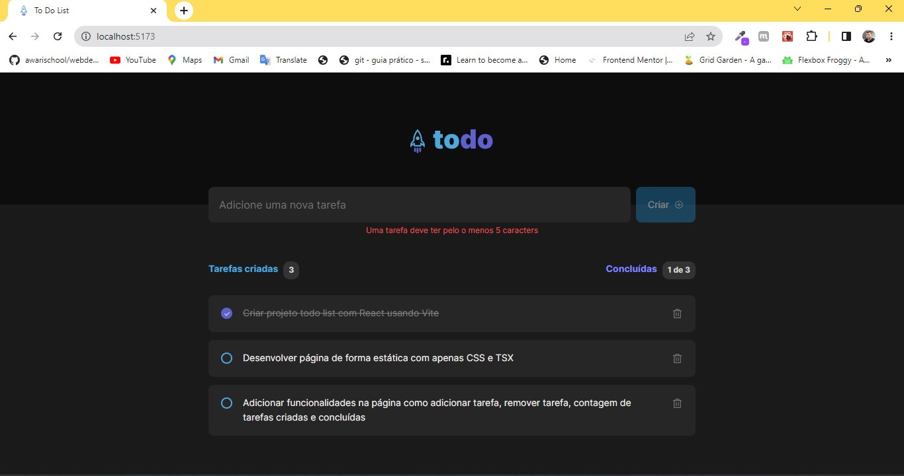

# **Todo List** 

## **Descrição**
Aplicação front-end para listagem de tarefas

## **Acessar Aplicação**
[https://todo-list-react-3383.vercel.app/?vercelToolbarCode=dDbhC-j2opHcJCE](https://todo-list-react-3383.vercel.app/?vercelToolbarCode=dDbhC-j2opHcJCE)

## **Objetivos**
- Criar aplicação com Typescript e React, usando o Vite, configurando um padrão de desenvolvimento com o ESLint e guardando os dados em localStorage

## **Tecnologias**
Este projeto foi desenvolvido com as seguintes ferramentas: 
- Typescript;
- CSS
- ReactJs;
- React Hooks;
- React Context API;
- Vite;
- ESLint;
- LocalStorage;

## **Requerimentos**
- Node.js;
- npm ou yarn;

## **Instalação**
`npm install`

## **Clone do Projeto**
`git clone https://github.com/WalkerBrum/todo-list-react.git`

# 📷 Demonstração da Aplicação

## **Autor e Agradecimento**

Eu, Walker Lobato, como desenvolvedor do projeto, sou extremamente grato por ter tido a oportunidade de participar deste desafio. Foi uma experiência enriquecedora que me permitiu explorar e familiarizar-me com novas ferramentas e tecnologias para o desenvolvimento com React, em particular, o Vite. Além disso, pude aprimorar minhas habilidades existentes, como o uso da Context API e o armazenamento de dados no LocalStorage. Essa experiência me proporcionou um crescimento significativo em minhas hard skills, permitindo-me aprofundar ainda mais meu conhecimento na construção de aplicações web. Estou entusiasmado em aplicar essas novas habilidades e conhecimentos em projetos futuros, contribuindo para o desenvolvimento contínuo das minhas capacidades como desenvolvedor.
